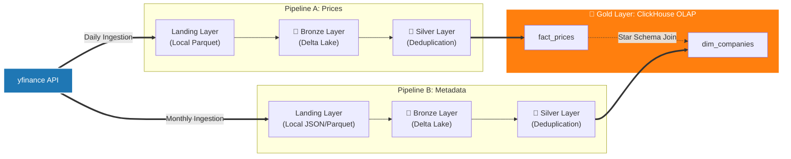

# End-to-End Batch Stock Market Pipeline


An end-to-end Data Engineering platform that ingests financial asset data and metadata from **B3, NASDAQ, and NYSE**, processes it through a **Medallion Architecture** (Landing → Bronze → Silver → Gold) using PySpark and Delta Lake, and delivers analytics-ready data via ClickHouse in a **Star Schema**.

Each pipeline is exposed as an isolated `make` command, allowing granular execution or direct mapping to an Airflow `BashOperator`.

## Table of Contents
1. [Architecture & Pipelines](#architecture--pipelines)
2. [Tech Stack](#tech-stack)
3. [Project Structure](#project-structure)
4. [Getting Started](#getting-started)
5. [Executing the Pipelines](#executing-the-pipelines)
6. [Running the Tests](#running-the-tests)
7. [ClickHouse Analytics Star Schema](#clickhouse-analytics-star-schema)
8. [CI/CD Pipeline](#cicd-pipeline)
9. [Roadmap & Future Improvements](#roadmap--future-improvements)

---

## Architecture & Pipelines

Two parallel ELT pipelines populate a Star Schema in ClickHouse (`fact_prices` as the Fact Table and `dim_companies` as the Dimension Table).



**Pipeline A - Daily Stock Prices (Fact):** extracts daily OHLCV time-series from `yfinance`, stores raw Parquet files in the Landing zone, ingests into Delta Lake (Bronze), deduplicates via PySpark window functions (Silver), and loads into ClickHouse as `fact_prices`.

**Pipeline B - Monthly Metadata (Dimension):** extracts company information (sector, industry, country, isin, full_time_employees, exchange, currency, market cap, dividend yield) from `yfinance`, follows the same Bronze/Silver medallion flow, and loads into ClickHouse as `dim_companies`.

---

## Tech Stack


| Layer | Technology | Version | Why |
|---|---|---|---|
| **Language** | Python | `3.13-slim` | Current stable release; minimal Docker footprint via slim image. |
| **Java Environment** | OpenJDK | `21` | JVM runtime required by Apache Spark 4.x. |
| **Bronze / Silver** | PySpark + Delta Lake | `Spark 4.1.1` · `Delta 4.2.0` | ACID transactions, time travel, schema enforcement, and window-based deduplication. |
| **Gold / OLAP** | ClickHouse | `25.8 LTS (Alpine)` | Columnar OLAP database providing sub-second aggregations on large datasets. |
| **Database Driver** | clickhouse-connect | `Latest` | Official lightweight Python connector; no JDBC dependency required. |
| **Orchestration** | Apache Airflow | `3.2.2` | Decoupled architecture (`api-server`, `scheduler`, `dag-processor`) orchestrating Medallion tasks. |
| **Metastore** | PostgreSQL | `18-alpine` | Metadata database for Apache Airflow. |

---

## Project Structure

```text
stock_market_pipeline/
├── .github/
│   └── workflows/
│       └── ci.yml           # CI/CD GitHub Actions workflow
├── .env.example             # Environment variables template
├── Makefile                 # CLI task runner
├── pyproject.toml           # Unified Python config and dependencies (PEP 621/735)
├── uv.lock                  # Dependency lockfile (fully resolved)
├── airflow/                 # Centralized Airflow orchestration directory
│   ├── dags/                # Python DAG definitions
│   ├── config/              # Autogenerated configs and admin secrets
│   └── logs/                # Task execution logs
├── data/                    # Shared data volume (created at runtime)
│   ├── bronze/              # Delta Bronze layer (prices/ & metadata/)
│   ├── landing/             # Raw extractions (prices/ & metadata/)
│   └── silver/              # Delta Silver layer (prices/ & metadata/)
├── docker/
│   ├── Dockerfile           # Python 3.13 + Java 21 image
│   └── docker-compose.yml   # ClickHouse server + Python Spark executor
├── src/
│   ├── db_init/init.sql     # ClickHouse DDL (auto-run on first boot)
│   ├── producer/            # Landing layer (extraction)
│   │   ├── config.py        # Configs and path mappings
│   │   ├── generator.py     # Pipeline A: prices extractor
│   │   ├── metadata_generator.py # Pipeline B: metadata extractor
│   │   └── tickers.py       # Monitored tickers (NASDAQ, B3, NYSE)
│   ├── streaming/           # Medallion layers (Spark/Delta/ClickHouse)
│   │   ├── spark_session.py # SparkSession factory
│   │   ├── utils.py         # Shared IO utilities (Delta read/write & ClickHouse)
│   │   ├── bronze.py        # Bronze: prices ingestion
│   │   ├── silver.py        # Silver: prices deduplication
│   │   ├── bronze_metadata.py # Bronze: metadata ingestion
│   │   ├── silver_metadata.py # Silver: metadata deduplication
│   │   └── gold.py          # Gold: ClickHouse writer
│   └── utils/
│       └── logger.py        # Centralized Loguru logger configuration
└── tests/                   # Pytest suite
    ├── conftest.py          # PySpark and local delta test fixtures
    ├── producer/            # Tests for generator and ticker fetcher
    └── streaming/           # Medallion layer and ClickHouse integration tests
```

---

## Getting Started

### Prerequisites
- [Docker Desktop](https://docker.com) installed and running.
- `make` installed (`brew install make` on macOS / Linux).

### 1 — Configure environment variables

Duplicate the environment variables file and configure your credentials in the new `.env` file:

```bash
cp .env.example .env
```


### 2 — Build and start the containers

Start the multi-container environment (Airflow services, PostgreSQL metastore, ClickHouse, and Python workspace):

```bash
make build
```
This starts the following services:
- `stock_clickhouse`: ClickHouse server on HTTP port `8123` and native TCP port `9000`. Runs `src/db_init/init.sql` automatically on first boot.
- `airflow_postgres`: PostgreSQL 18 database metastore for Airflow.
- `airflow_init`: One-off database migration and admin user creation task.
- `airflow_apiserver`: Airflow 3 API Server and Web UI on port `8080`.
- `airflow_scheduler`: Airflow Scheduler orchestrating DAGs.
- `airflow_dag_processor`: Standalone Dag Processor parsing DAG definitions.
- `python_finance`: Isolated Python 3.13 workspace containing Java 21, Spark 4.1.1, and dev tools.

### 3 — Code Quality

This project uses [Ruff](https://docs.astral.sh/ruff/) for linting and formatting, 
configured in `pyproject.toml`.

**Line length:** 120 characters, enforced by `ruff format`. `E501` is disabled in 
the linter to avoid duplicate reporting.

To run checks inside the container:
```bash
make lint       # Check for style/lint issues
make lint_fix   # Check and apply auto-fixes for safe violations
make format     # Format files according to style guidelines
```

Or locally (outside the container, using uv):
```bash
uv run ruff check .          # linter
uv run ruff format --check . # verify formatting without applying changes
uv run ruff format .         # apply formatting
```

The CI pipeline runs both checks automatically on every push and pull request.


### 4 — Tear down the environment

```bash
make down # Stop and remove containers (data is preserved)
make clean # Stop containers and remove Docker volumes (ClickHouse data is lost)
make reset # Full reset: clean + remove local data/ directory
```

---

## Executing the Pipelines

### Run the full Medallion Pipeline
Triggers the entire workflow sequentially (Landing → Bronze → Silver → Gold):

```bash
make run          # Run the full pipeline (both prices and metadata) for local testing
make run_prices   # Run only the Prices pipeline (Daily)
make run_metadata # Run only the Metadata pipeline (Monthly)
```

### Run Layer-Specific Commands

#### Ingestion (Landing)

```bash
make run_landing_prices     # Extract daily prices from yfinance
make run_landing_metadata   # Extract company metadata from yfinance
```

#### Bronze

```bash
make run_bronze_prices      # Load prices parquet -> Delta Bronze
make run_bronze_metadata    # Load metadata parquet -> Delta Bronze
```

#### Silver

```bash
make run_silver_prices      # Deduplicate prices -> Delta Silver
make run_silver_metadata    # Deduplicate metadata -> Delta Silver
```

#### Gold

```bash
make run_gold               # Load Silver data into ClickHouse
```

---

## Running the Tests

The project includes a robust test suite with 42 unit and integration tests using 
`pytest` and `unittest.mock` to validate data quality, pipeline flows, exchange 
standardization, Spark deduplications, and ClickHouse transactional safety without 
requiring live database connections.

### Running inside the container
```bash
make test
```
Or directly:
```bash
docker exec python_finance pytest
```

### Running with coverage report
```bash
make test_cov
```
Or directly:
```bash
docker exec python_finance pytest --cov=src --cov-report=term-missing --cov-fail-under=80
```

The CI enforces a minimum coverage threshold of **80%**. Test configuration is 
defined in `pyproject.toml` under `[tool.pytest.ini_options]`.

---

## ClickHouse Analytics Star Schema

Connect with DataGrip, DBeaver, or any ClickHouse-compatible client to `localhost:8123` using the credentials from your `.env` file.

### Dimension Table: `stock_market.dim_companies`

| Column | Type | Sorting Key | Description |
|---|---|---|---|
| `ticker` | LowCardinality(String) | Yes | Stock ticker symbol |
| `short_name` | String | | Company display name |
| `sector` | LowCardinality(String) | | GICS sector classification |
| `industry` | LowCardinality(String) | | Industry classification |
| `country` | LowCardinality(String) | | Country where the company is based |
| `isin` | String | | International Securities Identification Number |
| `full_time_employees` | UInt32 | | Number of full-time employees |
| `exchange` | LowCardinality(String) | | Exchange (NASDAQ, NYSE, B3) |
| `market_cap` | UInt64 | | Market capitalization in USD |
| `currency` | LowCardinality(String) | | Currency in which the stock is traded |
| `dividend_yield` | Decimal(10,2) | | Annual dividend yield (%) |
| `extraction_date` | Date | | Date of yfinance extraction |
| `ingestion_timestamp` | DateTime | | Ingestion timestamp |
 
### Fact Table: `stock_market.fact_prices`

| Column | Type | Sorting Key | Description |
|---|---|---|---|
| `date` | Date | Yes | Trading date |
| `ticker` | LowCardinality(String) | Yes | Stock ticker symbol |
| `open` | Decimal(10,2) | | Opening price |
| `high` | Decimal(10,2) | | Daily high price |
| `low` | Decimal(10,2) | | Daily low price |
| `close` | Decimal(10,2) | | Closing price |
| `adj_close` | Decimal(10,2) | | Adjusted closing price |
| `volume` | UInt64 | | Shares traded |
| `dividends` | Decimal(10,2) | | Total dividends paid during the day |
| `stock_splits` | Decimal(10,4) | | Stock split ratio for the trading day |
| `ingestion_timestamp` | DateTime | | Ingestion timestamp |
 
> In ClickHouse, `MergeTree` does not have primary keys or foreign keys in the relational sense. The `ORDER BY` clause defines the **sorting key**,
which also serves as the implicit sparse index used to skip data blocks during queries. Deduplication is handled upstream in the Silver layer before data reaches ClickHouse.

> `fact_prices` is partitioned by `toYYYYMM(date)`, enabling partition
pruning on date range filters and efficient monthly data management.

### Example query

```sql
SELECT
    c.short_name,
    c.sector,
    MAX(p.close) AS peak_price,
    SUM(p.volume) AS total_traded_volume
FROM
   stock_market.fact_prices p
JOIN
   stock_market.dim_companies c ON p.ticker = c.ticker
GROUP BY
   c.sector,
   c.short_name
ORDER BY
   total_traded_volume DESC;
```

---

## CI/CD Pipeline

The project includes a GitHub Actions pipeline with two sequential jobs:

**`lint-and-test`** — runs on every push and pull request to `main` and `develop`:
- Ruff linter and formatter check
- Mypy strict type checking across `src/`
- pytest with 80% coverage enforcement

**`deploy`** — runs only on push to `main`, after `lint-and-test` passes:
- Builds the Docker image from `docker/Dockerfile`
- Pushes to GitHub Container Registry (GHCR) with two tags:
  - `latest` — always points to the most recent `main` build
  - `sha-<commit>` — immutable tag for full traceability

```bash
# Pull the latest published image
docker pull ghcr.io/eikesf/stock-market-pipeline:latest
```

---

## Roadmap & Future Improvements
- [x] **Orchestration:** Implement Apache Airflow DAGs to replace `make` command execution.
- [ ] **Data Quality:** Integrate Great Expectations or Soda for automated data quality assertions in the Silver layer.
- [ ] **Type Safety:** Achieve full Mypy strict compliance across the `src/` module.
- [ ] **Observability:** Add structured logging with correlation IDs per pipeline run.

